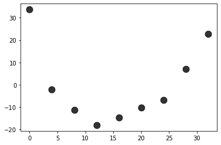

```python
import numpy as np
import pandas as pd
import matplotlib.pyplot as plt
from sklearn.linear_model import LinearRegression
from sklearn.metrics import mean_squared_error,mean_absolute_error, r2_score
import math
lr = LinearRegression()
```

# Sintetico #1


```python
df1  = pd.read_csv("Sintetico.csv",delimiter='\t',header=None)
df1.rename(columns={0:'x1',1:'x2',2:'target'},inplace=True)
X = df1.iloc[:,0].to_numpy().reshape(-1,1)
y = df1.iloc[:,1].to_numpy()
df1.head(3)
# y
# X
```


<div>
<style scoped>
    .dataframe tbody tr th:only-of-type {
        vertical-align: middle;
    }

    .dataframe tbody tr th {
        vertical-align: top;
    }

    .dataframe thead th {
        text-align: right;
    }
</style>
<table border="1" class="dataframe">
  <thead>
    <tr style="text-align: right;">
      <th></th>
      <th>x1</th>
      <th>x2</th>
      <th>target</th>
    </tr>
  </thead>
  <tbody>
    <tr>
      <th>0</th>
      <td>0.665117</td>
      <td>0.619822</td>
      <td>0</td>
    </tr>
    <tr>
      <th>1</th>
      <td>0.389321</td>
      <td>0.341135</td>
      <td>0</td>
    </tr>
    <tr>
      <th>2</th>
      <td>0.693654</td>
      <td>0.622386</td>
      <td>0</td>
    </tr>
  </tbody>
</table>
</div>


# Grafica #1


```python
plt.scatter(df1.x1,df1.x2,color="black",s=100,alpha=0.9)
```


    <matplotlib.collections.PathCollection at 0x7f08cf1c7b80>


    

    


# Regresion lineal


```python
X_train = X[:50]
X_test  = X[50:]
y_train = y[:50]
y_test  = y[50:]
lr.fit(X_train,y_train)
y_pred  = lr.predict(X_test) 
b1      = lr.coef_[0]
```

# Grafica #2


```python
plt.scatter(X_test,y_test,color="black",s=100)
plt.plot(X_test,y_pred,color="red")
```


    [<matplotlib.lines.Line2D at 0x7f08cd0bfbb0>]


    

    


## Error absoluto medio


```python
print('Mean absolute error: %.2f'% float(mean_absolute_error(y_test, y_pred)))
```

    Mean absolute error: 0.08


# Error cuadrado medio


```python
MSE = mean_squared_error(y_test, y_pred)
print('Mean squared error: %.2f'% MSE)
```

    Mean squared error: 0.01


# Raiz del error cuadrado medio  


```python
print('Root Mean squared error: %.2f'% math.sqrt(MSE))
```

    Root Mean squared error: 0.10


# Coeficiento de determinacion


```python
print('Coefficient of determination: %.2f'% float(r2_score(y_test,y_pred)*100 ) + "%")
```

    Coefficient of determination: 41.27%


# Grafica #3


```python
b0 = np.mean(y)-np.mean(X)*b1
plt.scatter(X,y,color="black")
plt.plot(X,b0 + b1*X,color="red")
```


    [<matplotlib.lines.Line2D at 0x7fa542466d68>]


    

    


## Residuals


```python
y_pred    = lr.predict(X)
residuals = y-y_pred
plt.scatter(X,residuals,color="black")
```


    <matplotlib.collections.PathCollection at 0x7fa540339a58>


    

    


# Sintetico 2


```python
lr2 = LinearRegression()
df2 = pd.read_csv("Sintetico2.csv",delimiter="\t",header=None)
df2.rename(columns={0:'x',1:'y'},inplace=True)
df2.drop(columns=[2],inplace=True)
X = df2['x'].to_numpy().reshape(-1,1)
y = df2['y'].to_numpy().reshape(-1,1)
```

# Grafica #1


```python
plt.scatter(X,y,color="black")
```


    <matplotlib.collections.PathCollection at 0x7f08cd09dcd0>


    

    


# Regresion lineal


```python
X_train = X[:50]
X_test  = X[50:]
y_train = y[:50]
y_test  = y[50:]
lr2.fit(X_train,y_train)
y_pred  = lr.predict(X_test) 
b1      = lr.coef_[0]
# b0 = np.mean(y)-np.mean(X)*b1
```

# Grafica #2


```python
plt.scatter(X_test,y_test,color="black",s=100)
plt.plot(X_test,y_pred,color="red")
```


    [<matplotlib.lines.Line2D at 0x7fa5400c3940>]


    

    


# Residuales


```python
y_pred    = lr2.predict(X)
residuals = y-y_pred
plt.scatter(X,residuals,color="black")
```


    <matplotlib.collections.PathCollection at 0x7f08cd005460>


    

    


# Data


```python
df = pd.read_csv("data.csv")
df
```


<div>
<style scoped>
    .dataframe tbody tr th:only-of-type {
        vertical-align: middle;
    }

    .dataframe tbody tr th {
        vertical-align: top;
    }

    .dataframe thead th {
        text-align: right;
    }
</style>
<table border="1" class="dataframe">
  <thead>
    <tr style="text-align: right;">
      <th></th>
      <th>x</th>
      <th>y</th>
    </tr>
  </thead>
  <tbody>
    <tr>
      <th>0</th>
      <td>0</td>
      <td>394.33</td>
    </tr>
    <tr>
      <th>1</th>
      <td>4</td>
      <td>329.50</td>
    </tr>
    <tr>
      <th>2</th>
      <td>8</td>
      <td>291.00</td>
    </tr>
    <tr>
      <th>3</th>
      <td>12</td>
      <td>255.17</td>
    </tr>
    <tr>
      <th>4</th>
      <td>16</td>
      <td>229.33</td>
    </tr>
    <tr>
      <th>5</th>
      <td>20</td>
      <td>204.83</td>
    </tr>
    <tr>
      <th>6</th>
      <td>24</td>
      <td>179.00</td>
    </tr>
    <tr>
      <th>7</th>
      <td>28</td>
      <td>163.83</td>
    </tr>
    <tr>
      <th>8</th>
      <td>32</td>
      <td>150.33</td>
    </tr>
  </tbody>
</table>
</div>


```python
lr3 = LinearRegression()
X       = df['x'].to_numpy().reshape(-1,1)
y       = df['y'].to_numpy().reshape(-1,1)
```


```python
plt.scatter(X,y,color="black")
```


    <matplotlib.collections.PathCollection at 0x7f08c76ddf10>


    

    


```python
lr3.fit(X,y)
b1     = lr3.coef_[0][0]
b0     = np.mean(y)-np.mean(X)*b1
```


```python
y_pred=lr3.predict(X)
```


```python
plt.scatter(X,y,color="black")
plt.plot(X,y_pred,color="red")
```


    [<matplotlib.lines.Line2D at 0x7f08c761d040>]


    

    


```python
residuals = y-y_pred
```


```python
plt.scatter(X,residuals,color="black",s=200)
```


    <matplotlib.collections.PathCollection at 0x7f08c75e1fd0>


    

    


```python
DV    = np.log10(y)
_DV   = np.log10(b0+b1*X)
pred  = np.power(10,_DV)
res   = y - pred
# y,pred
x0 = np.linspace(np.min(X),np.max(X),100)
y0 = np.zeros(100)
# plt.plot(x0,y0,color="red")
plt.scatter(X,res,color="black",s=120,alpha=0.8)
```


    <matplotlib.collections.PathCollection at 0x7f08c7d57070>


    

    


```python
# pred,y
plt.scatter(X,y,color="black")
plt.plot(X,pred,color="red")
```


    [<matplotlib.lines.Line2D at 0x7f08c80d5910>]


    

    


```python
print('Mean absolute error: %.2f'% float(mean_absolute_error(y, pred)))
MSE = mean_squared_error(y, pred)
print('Mean squared error: %.2f'% MSE)
print('Root Mean squared error: %.2f'% math.sqrt(MSE))
print('Coefficient of determination: %.2f'% float(r2_score(y,pred)*100 ) + "%")
```

    Mean absolute error: 14.09
    Mean squared error: 281.28
    Root Mean squared error: 16.77
    Coefficient of determination: 95.26%


```python
DV   = np.sqrt(y)
_DV  = np.sqrt(b0+b1*X)
pred = np.power(_DV,2)
res  = y-pred
plt.scatter(X,res,color="black")
```


    <matplotlib.collections.PathCollection at 0x7f08c80a9df0>


    

    


```python
print('Mean absolute error: %.2f'% float(mean_absolute_error(y, pred)))
MSE = mean_squared_error(y, pred)
print('Mean squared error: %.2f'% MSE)
print('Root Mean squared error: %.2f'% math.sqrt(MSE))
print('Coefficient of determination: %.2f'% float(r2_score(y,pred)*100 ) + "%")
```

    Mean absolute error: 14.09
    Mean squared error: 281.28
    Root Mean squared error: 16.77
    Coefficient of determination: 95.26%


```python
plt.scatter(X,y,color="black")
plt.plot(X,pred,color="red")
```


    [<matplotlib.lines.Line2D at 0x7f08c84e6cd0>]


    

    

